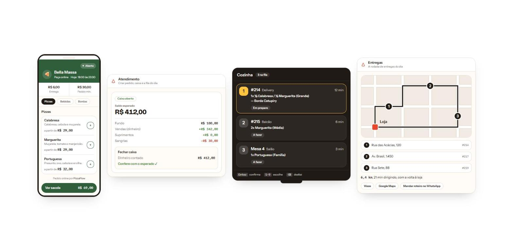
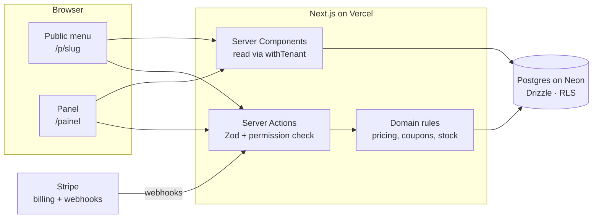

# PizzaFlow



<sub>From left: the customer's menu on a phone, closing the cash register, the kitchen queue in TV mode, and the delivery route.</sub>

**A complete system for pizzerias that runs in the browser.** Customers order from an online menu with no app and no sign-up; the team runs the counter, kitchen, tables and deliveries from one panel. Each store pays a flat monthly subscription, with no commission per order.

**Live:** [pizza-saas-delta.vercel.app](https://pizza-saas-delta.vercel.app) · built and maintained by me, end to end

> The source code is private because this is a commercial product. This repo is the public overview: what it does, how it's built and the decisions behind it. I'm happy to walk through the code on a call.

## What it does

**For the customer** (public menu, no login)
- Delivery or pickup, with the fee calculated from distance to the store
- Half-and-half pizzas, stuffed crusts and add-ons, priced the way pizzerias actually price them
- Pix payment by QR code or copy-and-paste, straight to the store's own key
- Table ordering by QR code, and a tracking link: received, preparing, out for delivery, delivered

**For the team** (back-office panel, 18 screens, permissions per store)
- **Counter and cash register:** open and close the register, change fund, withdrawals, split payments, and the expected balance before closing
- **Kitchen:** a queue built for a TV and a numeric keypad. `1-9` picks an order, `Enter` confirms, `Backspace` undoes. Tickets print automatically when an order comes in
- **Tables:** dine-in tabs, service fee, split, transfer and close
- **Deliveries:** suggested stop order on a map, shortcuts to Waze and Google Maps, and the route sent to the driver over WhatsApp
- **Menu, combos, coupons and stock**, with recipes that deduct ingredients as orders are sold
- **Reports and customers:** sales, best sellers, average ticket, and a simple CRM
- **Account:** subscription and plan, company details, delivery radius, opening hours, multiple stores, team invites and branding

## How it's built



| Layer | Choice |
| --- | --- |
| App | Next.js 16 (App Router), TypeScript strict, Tailwind v4, shadcn/ui |
| Data | PostgreSQL + Drizzle ORM, money always in integer cents |
| Auth | better-auth, with organizations as tenants and roles per store |
| Billing | Stripe Checkout, Customer Portal and webhooks |
| Email | Resend |
| Quality | Vitest, typecheck and lint gating every deploy |
| Infra | Vercel + Neon, local Postgres in Docker |

## Engineering decisions I'm proud of

**Every query is scoped to a tenant.** Reads and writes go through a `withTenant(accountId, ...)` helper and filter by account and store explicitly, with Postgres row-level security as a second layer. I extracted the pattern into a small open-source example with tests that try to break it: [multi-tenant-rls](https://github.com/TowerTKL/multi-tenant-rls).

**The server decides the price.** The client sends what was ordered (ids and quantities), never how much. Everything is recomputed on the server: sizes, half-and-half at the higher price, crusts, add-ons and combos.

**Coupons can't be over-redeemed.** Usage limits are enforced in a single atomic statement, so two customers hitting "apply" at the same moment can't both get the last use:

```sql
update coupons
   set used_count = used_count + 1
 where id = $1 and used_count < max_uses
returning id;
```

**Order history never changes.** Order items keep a snapshot of name and price, so editing the menu next month doesn't rewrite last month's sales. Every report reads from the same revenue base, so the numbers on different screens always agree.

**Billing that takes care of itself.** Stripe webhooks are idempotent (each event is processed once) and keep the account's plan in sync without manual steps.

**Dates in the store's time zone.** A sale at 11:30 pm on a Friday counts toward Friday. Reports cut days at local midnight, using a date filter that still hits the index.

**Boring deploys.** Production migrations are manual and reviewed. Nothing ships unless typecheck, lint, build and tests are all green.

## How I work on it

I design the data model and the architecture, and I use Claude every day as a pair to move faster: drafting, reviewing and testing. Decisions are written down in a living `CONTEXTO.md` and two Obsidian vaults, one for product and one for how the code connects, so the reasoning survives longer than my memory of it.

---

Made by [Kevyn Tintino](https://www.linkedin.com/in/kevyntintino) · [GitHub](https://github.com/TowerTKL)
