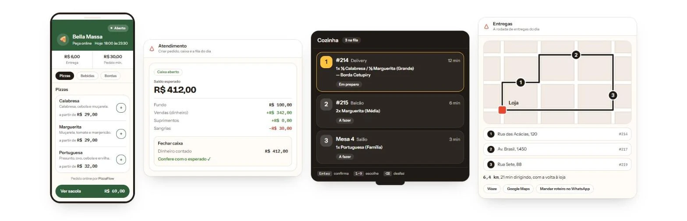
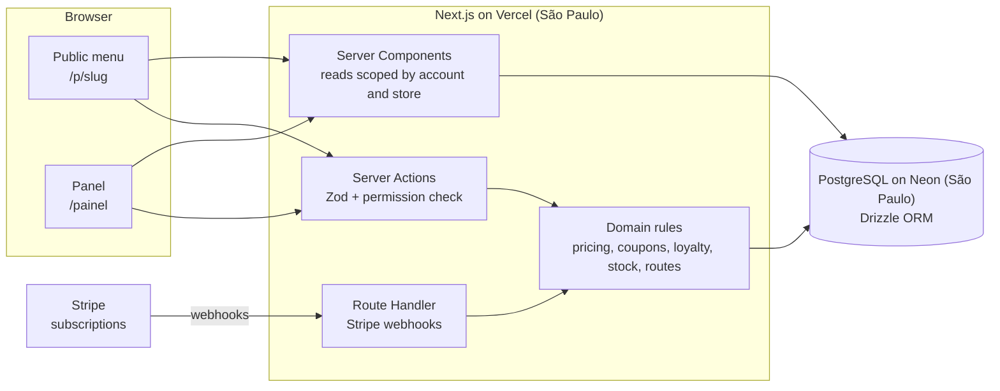

# PizzaFlow



<sub>Illustration of four product screens, from left: the customer's menu on a phone, closing the cash register, the kitchen queue in TV mode, and the delivery route.</sub>

**A complete system for pizzerias that runs in the browser.** Customers order from an online menu with no app and no sign-up. The team runs the counter, kitchen, tables and deliveries from one panel, on a computer, tablet or phone. Pricing is a flat monthly subscription per store, with no commission per order.

**Website:** [pizza-saas-delta.vercel.app](https://pizza-saas-delta.vercel.app) · built and maintained by me, end to end

> The source code is private because this is a commercial product. This repo is the public overview: what it does, how it's built and the decisions behind it. I'm happy to walk through the code on a call.

**3,500+** automated tests · **50+** database tables · **45+** migrations · **6** stackable roles per store · **240+** commits since July 2026

## What it does

**For the customer** (public menu, no login, no app)
- Delivery or pickup, now or scheduled for later (each store turns scheduling on). The delivery fee can come from the distance to the store, in up to three bands
- Half-and-half pizzas, stuffed crusts, add-ons and combos, with the price updated at every choice
- Coupons, and an optional loyalty card that is just the customer's phone number: no code, no sign-up
- Pix by QR code or copy-and-paste, straight to the store's own key, with no intermediary
- An order status page (received, preparing, ready, out for delivery, delivered), where the customer can also confirm they got the order
- Table ordering by QR code, straight into that table's tab
- The menu carries the store's own name, color and logo, with one link per store

**For the team** (back-office panel, 20+ screens, roles per store)
- **Counter and cash register:** orders on four channels (counter, delivery, pickup and table), open and close the register, change fund, withdrawals, a payment split across two methods, and the expected balance checked against the counted cash at closing
- **Kitchen:** a three-column queue and a TV mode driven by the numeric keypad. `1-9` picks an order, `Enter` confirms, `Backspace` undoes. Optional stations (oven, bar, desserts) split the items by category, and scheduled orders wait aside until it's time to start. The kitchen can have the print dialog for each ticket open on its own when an order comes in
- **Tables:** dine-in tabs with an optional 10% service fee, transfer, merge tables, split per person, and a QR code per table
- **Deliveries:** the day's run in three lists, a map with the street path, the suggested stop order, distance and driving time, shortcuts to Waze and Google Maps, and the route sent to the driver over WhatsApp. Drivers don't need a login, and the panel shows how many deliveries each one made today and how much each one is owed
- **Menu, combos, coupons and stock:** four pizza sizes, items that are Active, Out of stock or Paused, half-and-half at the higher price or the average (each store chooses), coupons with a minimum order, an expiry date and an exact usage limit, and recipes per pizza size that can deduct ingredients when a sale closes
- **Reports:** revenue, sales, average ticket and items sold against the previous period, operation times (queue, prep, delivery, total) with mean and median, busiest hours and weekdays, products that didn't sell, and the full order history with filters kept in the URL
- **Customers:** a customer list that builds itself from paid orders, with New, Loyal and Lapsed segments, a profile per customer, and a ready-written WhatsApp message to win back the ones who stopped ordering
- **Printing:** four documents on 80 mm thermal paper: the kitchen ticket (no prices), the customer receipt, the table bill and the delivery label
- **Account:** several stores per account (billed per store), opening hours with an emergency pause, delivery bands and Pix key, branding, company details filled in from the CNPJ (Brazil's company tax ID), and team invites by link with stackable roles per store

Every panel screen passes a phone check at 375 px (44 px touch targets, AA contrast). The kitchen screen is built for a tablet or a TV on the wall.

## How it's built



| Layer | Choice |
| --- | --- |
| App | Next.js 16 (App Router), React 19, TypeScript strict, Tailwind CSS v4, shadcn/ui |
| Data | PostgreSQL + Drizzle ORM, money always in integer cents |
| Auth | better-auth, with organizations as tenants and roles per store |
| Billing | Stripe Checkout, Customer Portal and webhooks |
| Email | Resend |
| Maps | Leaflet, with the stop order computed on the server |
| Quality | Vitest (3,500+ tests). Definition of done for every feature: typecheck, lint, build and tests green |
| Infra | Vercel and Neon, both in São Paulo. Local Postgres in Docker |

## Engineering decisions I'm proud of

**Tenant isolation, checked in code.** Queries filter by account and store explicitly, and Server Actions check the user's permission on the server, not just in the UI. A dedicated test suite fails if a covered query loses its account or store filter. Separately, I published a small open-source reference implementation of Postgres row-level security, with tests that try to break it: [multi-tenant-rls](https://github.com/TowerTKL/multi-tenant-rls).

**The server decides the price.** The client sends what was ordered (ids and quantities), never how much. The server recomputes everything: sizes, half-and-half (higher price or average, as each store chooses), crusts, add-ons, combos, delivery fee, coupon and loyalty reward.

**Coupons can't be over-redeemed.** The usage limit is enforced by one conditional `UPDATE`, inside the same transaction that creates the order. Two customers placing an order with the last use at the same moment can't both get it, and a failed order gives the use back:

```sql
update coupons
   set used_count = used_count + 1
 where id = $1
   and active
   and (max_uses is null or used_count < max_uses)
returning id;
```

The loyalty reward follows the same rule: two people at the counter can't spend the same reward twice.

**The cash register closes on the server.** At closing, the server recomputes the expected cash with the register session row locked (`SELECT ... FOR UPDATE`). Every write that touches the drawer locks that session first, so a withdrawal logged during the close waits its turn instead of creating a phantom shortfall, and these writes queue instead of deadlocking.

**Order history never changes.** Order items keep a snapshot of name and price, so editing the menu next month doesn't rewrite last month's sales. What counts as a sale (paid and not cancelled) lives in one function that the revenue queries share.

**Dates in Brazilian time, not server time.** A sale at 11:30 pm on a Friday counts toward Friday, whatever time zone the server runs in. Reports cut days at São Paulo midnight, with a date filter that still hits the index.

**Delivery stop order, computed in-house.** The server orders the stops by nearest neighbour, then improves the route with 2-opt, which undoes the crossings the greedy pass leaves. If the street routing service doesn't answer, the map falls back to straight lines and says so. The delivery run never blocks.

**Billing that takes care of itself.** Stripe webhooks land on a Route Handler, and each event id is stored once, so a retried event is never applied twice. The account's plan stays in sync without manual steps.

**The sales site can't bring back a cut promise.** A test scans the marketing site's copy and fails if it uses a phrase from a blocklist of promises the product doesn't keep yet, such as live driver tracking.

**Boring deploys.** Production migrations are applied by hand and reviewed.

## Status and roadmap

PizzaFlow is live in pre-launch. Billing still runs in Stripe's test mode, so no store pays yet.

Planned:
- A no-login page per driver, with the route and delivery confirmation on the phone
- A self-serve free trial

## How I work on it

I design the data model and the architecture, and I use Claude every day as a pair to move faster: drafting, reviewing and testing. Decisions are written down in a living `CONTEXTO.md` and two Obsidian vaults, one for product and one for how the code connects, so the reasoning survives longer than my memory of it.

---

Made by [Kevyn Tintino](https://www.linkedin.com/in/kevyntintino) · [GitHub](https://github.com/TowerTKL) · © 2026, all rights reserved
